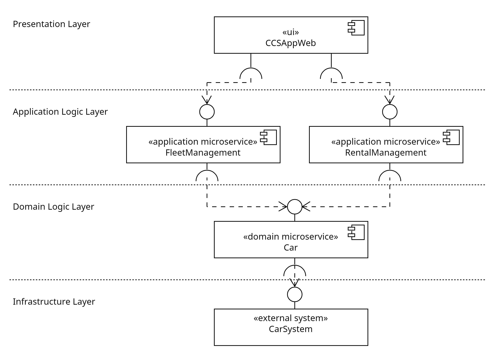

# Software Architecture of CCSApp

The software architecture of CCSApp is based on MuleSoft's integration architecture which is extended by a domain logic layer. The layers and their components are described in the following. 

## Infrastructure Layer

The infrastructure layer comprises the external systems. External systems need to be integrated. For each external system, one System API exists, which integrates the data or functionality of the underlying external system. The System API S-DaimlerCar accesses the dedicated model car by communicating with their API. Therefore, it provides static car data (e.g., vin, brand) and dynamic data (e.g., access to the trunk) to the Domain API and the Process APIs. Similarly, the System API S-RentalData accesses the RentalSystem. S-RentalData provides Create, Read, Update, Delete (CRUD) operations for the car's rental periods through a RESTful API.

## Domain Logic Layer

The domain logic layer comprises the Domain APIs. Domain APIs are optional, which means the Process APIs could also use the System APIs directly. However, the Domain API D-Car is used to unify heterogeneous car data. The development of the Domain API is strongly influenced by Domain-Driven Design (DDD).

The Domain API D-Car unifies a subset of the car data that is domain-specific. If possible, a Process API should use the Domain API to retrieve manufacturer-independent data. Because when new car manufacturers are integrated, the Process API does not have to be modified as the Domain API endpoints will remain unchanged.

## Application Logic Layer

The application logic layer contains the Process APIs which are derived from the capabilities. The Process API P-FleetManagement implements the use cases regarding the management of the fleet with the information provided by D-Car and S-RentalData.

## Presentation Layer

The presentation layer contains the Experience API E-CCSAppWeb and the user interface UI-CCSAppWeb. E-CCSAppWeb forwards the requests from UI-CCSAppWeb to P-FleetManagement. 

