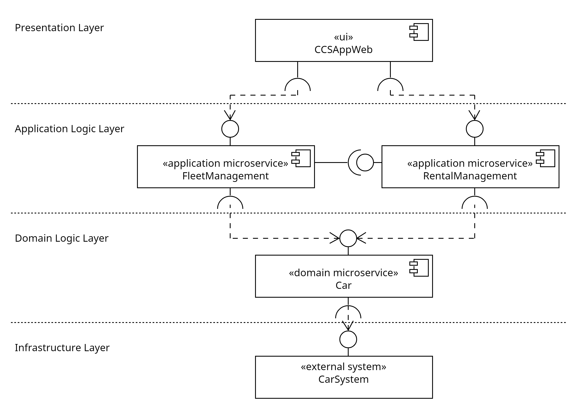

# Software Architecture of CCSApp

## Infrastructure Layer

The infrastructure layer comprises the external systems. External systems need to be integrated. For each external system, one System API exists, which integrates the data or functionality of the underlying external system. The System API provides static car data (e.g., vin, brand) and dynamic data (e.g., access to the trunk) to the Domain API.

## Domain Logic Layer

The domain logic layer comprises the Domain APIs. The development of the Domain API is strongly influenced by Domain-Driven Design (DDD).

The Domain API D-Car unifies a subset of the car data that is domain-specific. A Process API should use the Domain API to retrieve manufacturer-independent data. Because when new car manufacturers are integrated, the Process API does not have to be modified as the Domain API endpoints will remain unchanged.

## Application Logic Layer

The application logic layer contains the Process APIs which are derived from the capabilities. The Process API P-FleetManagement implements the use cases regarding the management of the fleet with the information provided by D-Car.

## Presentation Layer

The presentation layer contains the user interface UI-CCSAppWeb.

