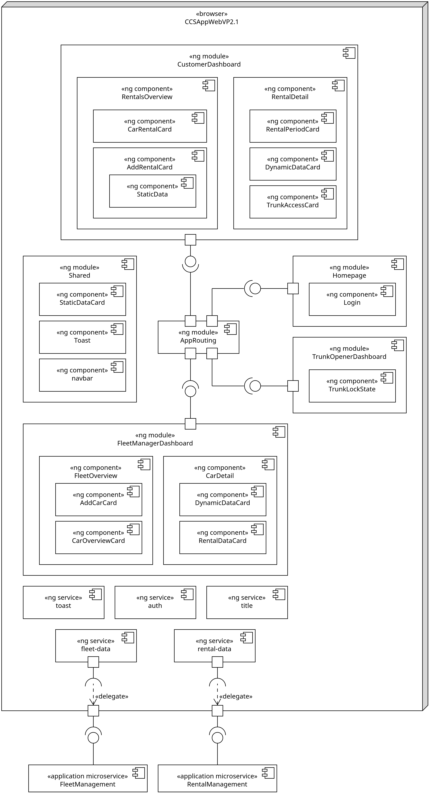
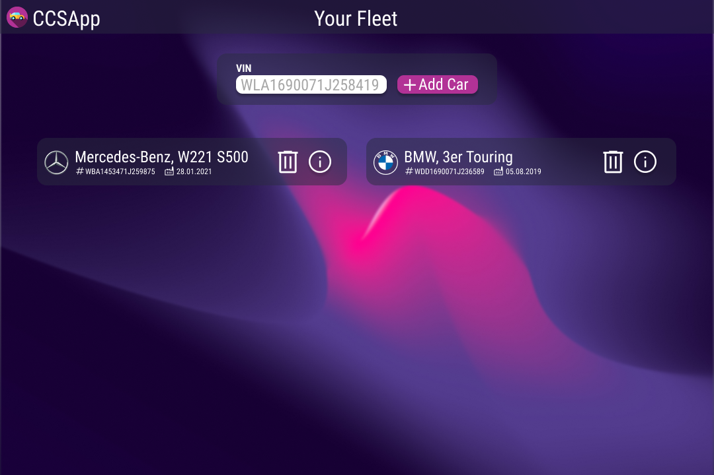
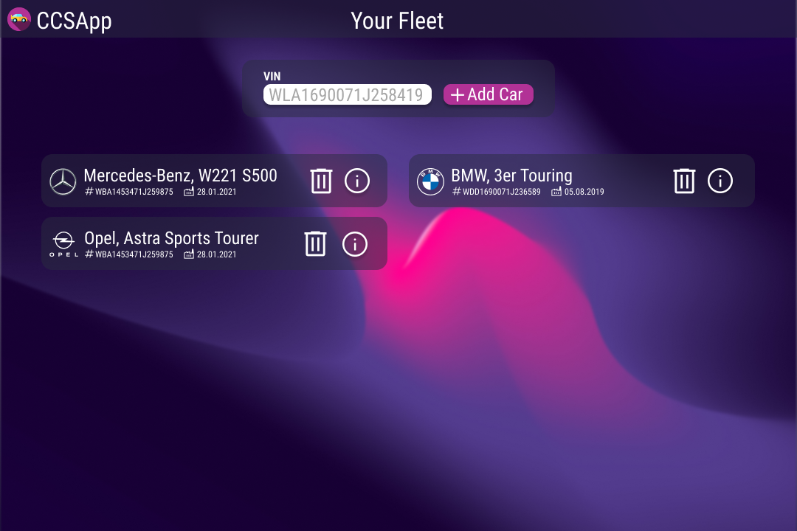

# UI Architecture

The following architecture depicts V1.0 of the UI-CCSAppWebVP. The architecture consists of the UI-CCSAppWebVP itself and the Process API which provides all data as a RESTful web service.

</img>

## UI-CCSAppWeb

The UI is implemented in Angular and consists of a variety of components that are responsible for displaying data; and services, which implement the necessary logic for fetching and updating the data.

### Module AppRouting

The module AppRouting is responsible for mapping Angular components to routes. It uses the underlying Angular Routing [Ang-Rou] module. For now there will be only one route which maps to the overview component. Still this Module is added for expandability reasons. This facilitates the addtion of future components. 

### Component FleetOverview

The component FleetOverview is responsible for displaying fleet data. It displays a table that summarizes all of the vehicles in the manager's fleet and allows for adding and removing vehicles to the fleet. From this component it will be possible to start the use cases ["Add Car to Fleet"](./use_case_add_car_to_fleet.md) and ["Remove Car from Fleet"](./use_case_remove_car_from_fleet.md)  

### Fleet Management Service

The P-Fleet-Management service implements the backend communication required by the component FleetOverview. This includes the logic to fetch the fleet data from the backend and to send HTTP requests to add or remove cars from the fleet. Under the hood, the service uses Angular's HTTP client to perform the HTTP requests. The URL of the Process API is injected into the service as an environment variable. 

## Backend Connection

The CCSApp backend consists of multiple microservices which are implemented using GoLang. For more information on the backend, refer to the relevant documentation [here](../README.md).
For the UI, only the Process API will be called. That API will therefore provide the necessary endpoints for requesting the overview as well as adding and deleting cars from the fleet.

## UI Mockups

This section contains our mockups which show how the UI is supposed to look like once implemented. 

### Mockup for Use Case ["View Fleet Overview"](./use_case_view_fleet_overview.md)

Desktop:  

Mobile:  

### Mockup for Use Case ["Add Car to Fleet"](./use_case_add_car_to_fleet.md)

Desktop:  

Desktop: user entered invalid VIN:  

Desktop: user tried to add a car that is already part of the fleet  

### Mockup for Use Case ["Remove Car from Fleet"](./use_case_remove_car_from_fleet.md)

Desktop:  

Mobile:  

### Mockup for ["View Car Detail"](./use_case_view_car_status.md)

Desktop:  

Mobile:  

#Mockup for ["View Rentals Overview"](./use_case_view_rentals_overview.md)

Desktop:  

Mobile:  

### Mockups for ["View Rental Status"](./use_case_view_rental_status.md), ["Change Trunk Lock State"](./use_case_change_trunk_lock_state.md) as a Customer, ["Grant Trunk Access"](./use_case_grant_trunk_access.md) 

Desktop:  
  
  
  

Mobile:  

### Mockup for ["Create Car Rental"](./use_case_create_car_rental.md)

Desktop:  

Mobile:  

### Mockup for ["Change Trunk Lock State"](./use_case_change_trunk_lock_state.md) as Trunk Opener  

Desktop:  

Mobile:  

## Abbreviations

* CCSAppWeb ConnectedCarServicesApplicationWebInterface
* VIN vehicle identification number
* UI User Interface

## Sources

* [Ang-Rou] Angular: RouterModule https://angular.io/api/router/RouterModule, accessed on: 2022-10-20.
