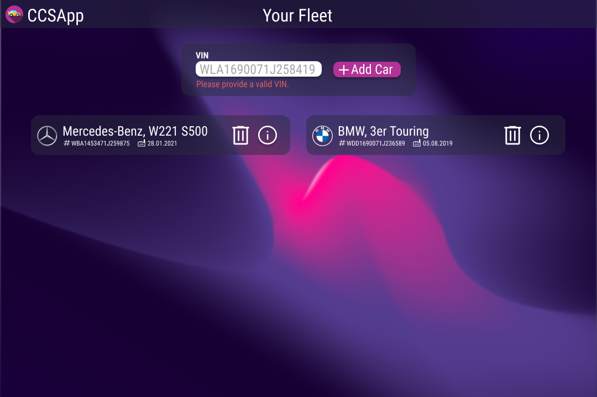
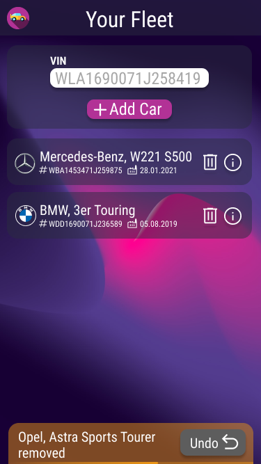

# UI Architecture

The following architecture depicts V2.1 of the CCSAppWebVP. The architecture consists of the CCSAppWebVP itself and the microservice FleetManagement as well as a microservice RentalManagement, which provide all data as a RESTful web service.

</img>

## Routing within the App

`/` provides the login page.

`/dashboard` routes the user to their dashboard. For a Fleet Manager this will be the fleetOverview located within the FleetManagerDashboard module, for a Customer this will be the rentalsOverview located within the CustomerDashboard module.

`/trunkAccess/:vin?token=exampleToken` provides the current trunk lock state to a trunk opener and allows him to change it.

## CCSAppWeb Modules and Services

The next section gives an overview of the modules and services of CCSAppWeb v2.1.

### Module AppRouting

The module AppRouting is responsible for mapping routes to Angular components. It uses the underlying Angular Routing [Ang-Rou] module. For an overview of the routes see section `Routing within the App`.

### Module FleetManagerDashboard

With this module a FleetManager can see their fleet and details of the cars within. They can also add and remove cars from the fleet.

### Module CustomerDashbaord

This module enables a Customer to view and create rentals, as well as grant trunk accesss to an active rental.

### Module TrunkOpenerDashboard

This modules holds the components that enables a Trunk Opener to view and change a car’s trunk lock state.

### Module Shared

This module contains all shared components, such as the staticDataCard component and the toast component.

### Toast Service

The toast service manages messages that need to be displayed to a user while using our app. These messages are mainly error messages. It correlates with the toast component that actually displays the message to the user.

### Auth Service

The auth service stores authorisation information, that is a user’s role and their login status.

### Title Service

The title service is responsible for displaying the correct title within the navbar.

### Fleet Data Service

The fleet-data service communicates with the microservice FleetManagement. It can GET a fleet, PUT and DELETE cars, as well as GET the status of a car.

### Rental Data Service

The rental-data service communicates with the microservice RentalManagement. To view all implemented methods see the API Diagramm or the [OpenAPISpec](https://github.com/ccsapp/RentalManagementDesign/blob/main/openapi.yaml).

## Backend Connection

The CCSApp backend consists of multiple microservices which are implemented using GoLang. For more information on the backend, refer to the relevant documentation [here](../README.md).
For the UI, only the Process API will be called. That API will therefore provide the necessary endpoints for requesting the overview as well as adding and deleting cars from the fleet.

## UI Mockups

This section contains our mockups which show how the UI is supposed to look like once implemented. 

### Mockup for Use Case ["View Fleet Overview"](./use_case_view_fleet_overview.md)

Desktop:  

Mobile:  

### Mockup for Use Case ["Add Car to Fleet"](./use_case_add_car_to_fleet.md)

Desktop:  

Desktop: user entered invalid VIN:  

Desktop: user tried to add a car that is already part of the fleet  

### Mockup for Use Case ["Remove Car from Fleet"](./use_case_remove_car_from_fleet.md)

Desktop:  

Mobile:  

### Mockup for ["View Car Detail"](./use_case_view_car_status.md)

Desktop:  

Mobile:  

#Mockup for ["View Rentals Overview"](./use_case_view_rentals_overview.md)

Desktop:  

Mobile:  

### Mockups for ["View Rental Status"](./use_case_view_rental_status.md), ["Change Trunk Lock State"](./use_case_change_trunk_lock_state.md) as a Customer, ["Grant Trunk Access"](./use_case_grant_trunk_access.md) 

Desktop:  
  
  
  

Mobile:  

### Mockup for ["Create Car Rental"](./use_case_create_car_rental.md)

Desktop:  

Mobile:  

### Mockup for ["Change Trunk Lock State"](./use_case_change_trunk_lock_state.md) as Trunk Opener  

Desktop:  

Mobile:  

## Abbreviations

* CCSAppWeb ConnectedCarServicesApplicationWebInterface
* VIN vehicle identification number
* UI User Interface

## Sources

* [Ang-Rou] Angular: RouterModule https://angular.io/api/router/RouterModule, accessed on: 2022-10-20.
