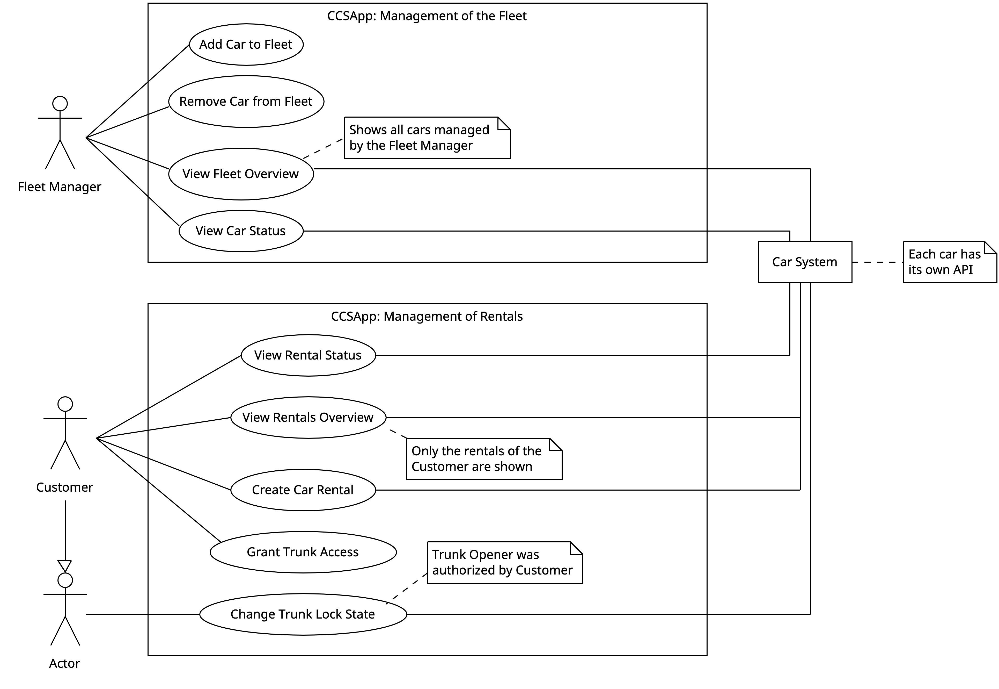

# Use Case Diagram (V2)

The use cases are further described below and are independent of a concrete case study. The use cases are grouped into the capability they belong. The capability "Management of Fleet" includes the functionality that a fleet manager needs to control (i.e., add and remove cars from the fleet) and to monitor (i.e., get the relevant information) the fleet. The capability "Management of Rental Services" grants customers additional services for the rental cars.

## Use Cases: Management of Fleets

([Add Car to Fleet](use_case_add_car_to_fleet.md)) A car is added to the fleet with its static car data such as vin, brand, model, fuel type is stored. Each car has its own fleet id. The static car data is not entered manually but is received from the system Connected Car. 

([Remove Car from Fleet](use_case_remove_car_from_fleet.md)) A car which is removed from the fleet is no longer available in the fleet overview.

([View Fleet Overview](use_case_view_fleet_overview.md)) A fleet manager can list cars of the fleet based on search criteria which belong to the company. This fleet overview contains the static information of a car (such as VIN, brand, model, construction year, and existing rentals). 

([View Car Status](pages/use_case_view_car_status.md)) A fleet manager can show the status of a car in the fleet. This status view contains static and dynamic information on the car and its next active rental.

## Use Cases: Management of Rentals

([View Rental Status](pages/use_case_view_rental_status.md)) A customer can view the status of a rental with static car data and rental information as well as dynamic car data while the rental is active.

([View Rentals Overview](pages/use_case_view_rentals_overview.md)) A customer can list all their rentals.

([Create Car Rental](pages/use_case_create_car_rental.md)) A customer can create a new car rental, that is rent a car.

([Grant Trunk Access](pages/use_case_grant_trunk_access.md)) A customer can grant a trunk opener the permission to access their car trunk of a rental.

([Change Trunk Lock State](pages/use_case_change_trunk_lock_state.md)) A customer or trunk opener can change the trunk lock state given they have the required permission.

## Involved External Systems
The following external systems are required to fulfill the requirements.

|          External System | Description                                                                                                                                                       |
| ------------------------ | ----------------------------------------------------------------------------------------------------------------------------------------------------------------- |
| Connected Car System     | Each concrete connected car system has its own API for their cars.                                                                                                |
